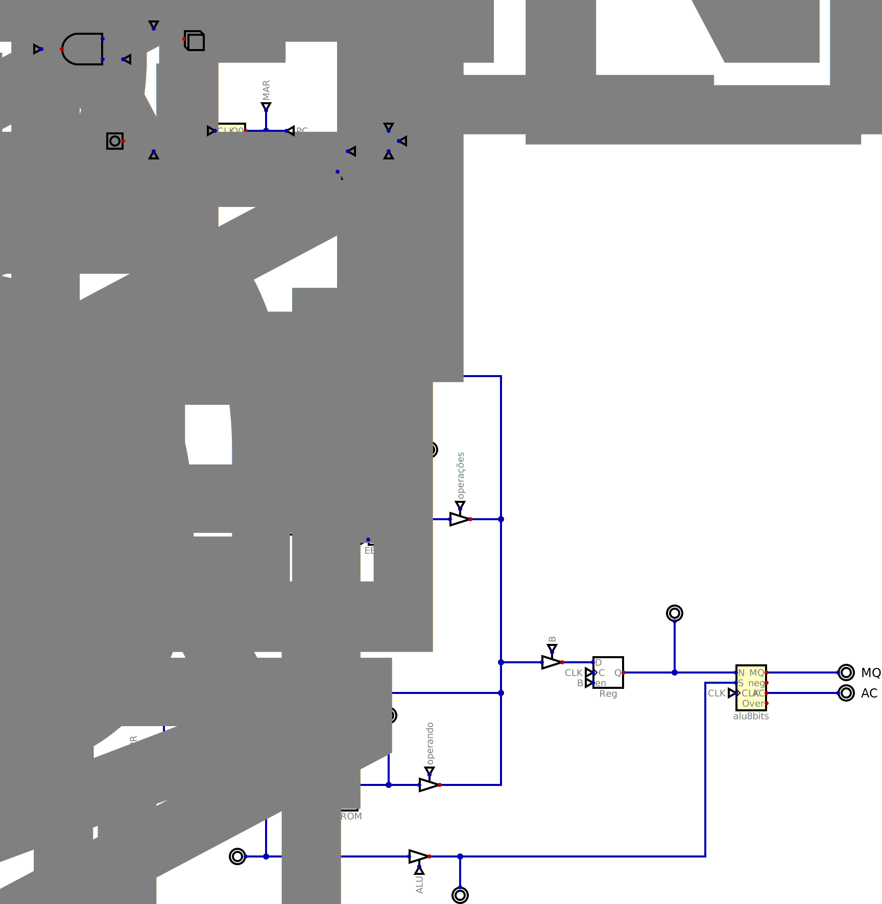

# CPU de 8 bits

## Descrição

Este projeto consiste na implementação de uma CPU de 8 bits baseada na arquitetura SAP (Simple As Possible), desenvolvida utilizando a ferramenta Digital.

A CPU é responsável por executar instruções básicas, realizando o ciclo de busca, decodificação e execução, utilizando uma ALU integrada para operações aritméticas e lógicas.

---

## Visão Geral da CPU

Figura 01 - CPU 8 bits

Fonte: Material produzido pelos autores (2026)

 

---

## Funcionalidades

A CPU é capaz de:

* Executar instruções básicas
* Realizar operações aritméticas e lógicas via ALU
* Controlar fluxo de dados entre registradores
* Executar operações sequenciais através de controle por estados

---

## Estrutura do Projeto

O projeto é composto por:

* Unidade de Controle:
  * Contador de programa (PC)
  * Contador de anel (Ring Counter)
  * Decodificação de instruções
* Unidade Lógica e Aritmética (ALU)
* Registradores:
  * AC (Acumulador)
  * MQ
  * Registradores auxiliares
* Barramentos de dados
* Memória (quando aplicável)

---

## Documentação

A explicação detalhada do funcionamento da CPU, incluindo contadores, arquitetura SAP e integração com a ALU, está disponível na documentação do projeto.

---

## Tecnologias Utilizadas

* Digital — simulador de circuitos digitais

---

## Demonstração

[Vídeo explicativo da CPU](https://drive.google.com/file/d/1HP_JwJ4znpkMqnLLXMRlgXwIivS1yH9s/view?usp=drivesdk)

---

## Como executar

1. Baixe os arquivos `.dig`
2. Abra no software Digital
3. Execute a simulação
4. Acompanhe o fluxo de execução das instruções