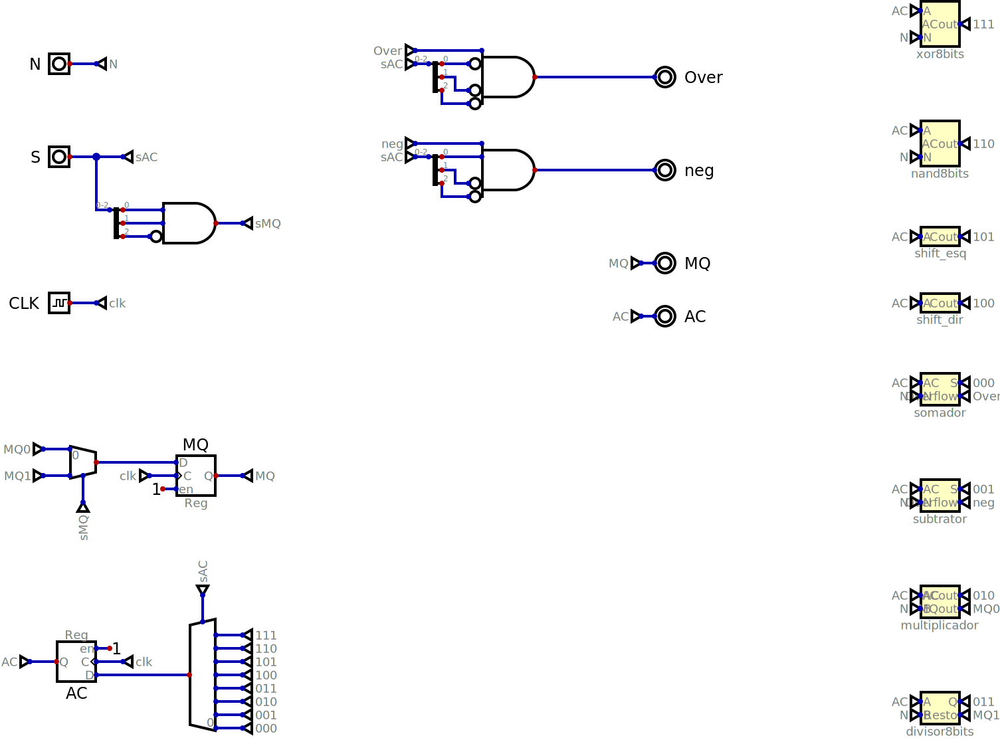

# ALU de 8 bits

## Descrição

Este projeto consiste na implementação de uma Unidade Lógica e Aritmética (ALU) de 8 bits, desenvolvida utilizando a ferramenta Digital.

A ALU realiza operações aritméticas e lógicas entre dois operandos, utilizando circuitos digitais construídos a partir de portas lógicas básicas, com arquitetura modular e reutilização de componentes.

---

## Visão Geral da ALU

Figura 01 - ALU 8 bits

Fonte: Material produzido pelos autores (2026)

 

---

## Funcionalidades

A ALU implementa as seguintes operações:

* Soma
* Subtração
* Multiplicação
* Divisão
* Shift lógico (esquerda e direita)
* NAND
* XOR

---

## Estrutura do Projeto

O projeto é composto por:

* Circuitos das operações:

  * Somador de 8 bits
  * Subtrator de 8 bits
  * Multiplicador de 8 bits
  * Divisor de 8 bits
  * Shift lógico à esquerda
  * Shift lógico à direita
* Seletor de operações (multiplexador)
* Registradores:

  * AC (Acumulador) → armazena resultados
  * MQ → utilizado em multiplicação e divisão

---

## Documentação

A explicação detalhada do funcionamento de cada circuito, otimizações e integração da ALU está disponível na documentação do projeto.

---

## Tecnologias Utilizadas

* Digital — simulador de circuitos digitais

---

## Demonstração

[Vídeo 1](https://drive.google.com/file/d/1Su9SnUXl8UUtmjkpUgPXIMOIgQJM5NH6/view?usp=sharing)

[Vídeo 2](COLE_AQUI_O_LINK_DO_VIDEO_2)

---

## Como executar

1. Baixe os arquivos `.dig`
2. Abra no software Digital
3. Execute a simulação
4. Teste as operações alterando as entradas

---

Se quiser dar um toque final mais profissional ainda, dá pra colocar uma **legenda tipo “Figura 1 – Arquitetura da ALU” embaixo da imagem** — detalhe pequeno, mas professor costuma valorizar 👍
